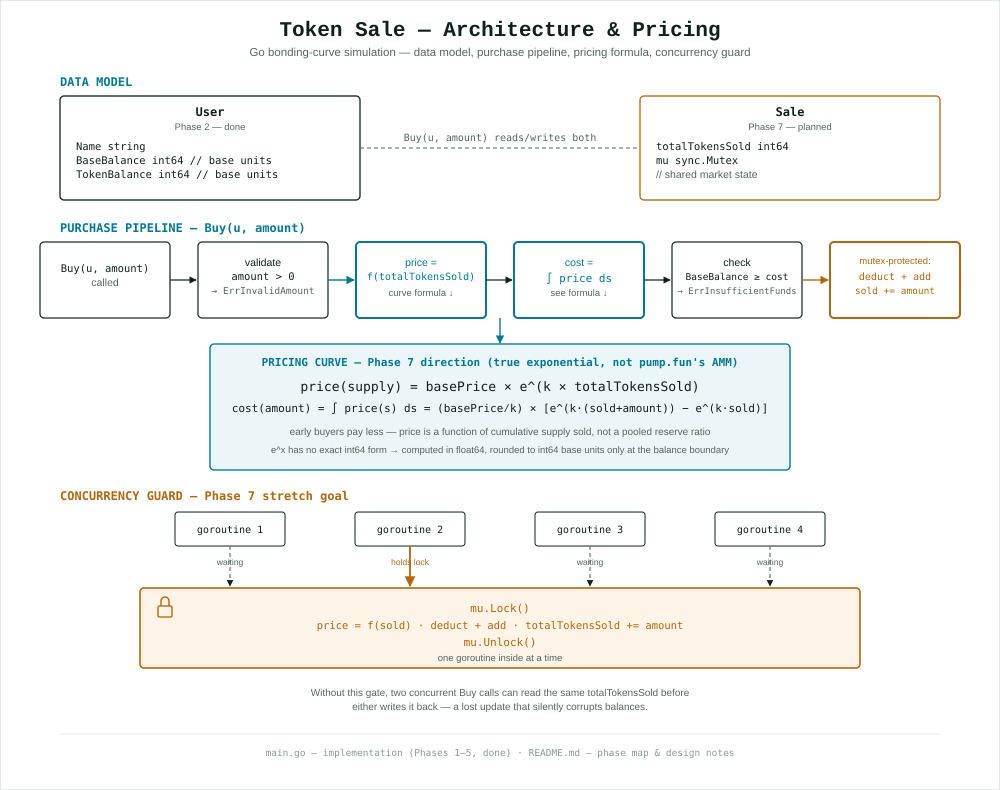

# token sale

A token sale simulation in Go, built phase by phase. **Phases 1 to 4 are done.**

```sh
go run .
```

## Architecture



Shows where the project stands (`User`, done, Phase 2) alongside where Phase 7
is headed (`Sale`, the exponential pricing formula, and the `sync.Mutex`
critical section) — see the phase map below for what's actually built today.

## About the pump.fun bonding curve

The starting assumption was "exponential bonding curve". That's not what pump.fun
uses. This section is background on pump.fun's real mechanism, not a description
of what this project builds — see "Where the curve goes" below for that.

**Short answer: hyperbolic, not exponential.** `price = virtualSol /
virtualToken` is a ratio (from the invariant `virtualToken × virtualSol = k`),
which is a hyperbola's shape — not a constant raised to a power of supply,
which is what "exponential" actually means. It only *looks* exponential on a
chart, especially near graduation.

**"Hybrid" and "hyperbolic" answer different questions.** If you've seen
pump.fun described as a "hybrid bonding curve" elsewhere, that's describing
the *launch mechanism* — trade on the internal virtual-reserve curve, then
migrate to a real AMM pool at graduation, a two-stage lifecycle — not the
pricing formula itself. The formula used during stage one is the hyperbolic
one above; "hybrid" and "hyperbolic" aren't competing answers to the same
question.

pump.fun runs a constant product AMM (Uniswap V2, `x·y = k`) over *virtual* reserves:

| | value |
|---|---|
| invariant | `virtual_token_reserves × virtual_sol_reserves = k` |
| initial `virtual_sol_reserves` | `30_000_000_000` lamports (30 SOL) |
| initial `virtual_token_reserves` | `1_073_000_000_000_000` base units |
| initial `real_token_reserves` | `793_100_000_000_000` base units |
| `token_total_supply` | `1_000_000_000_000_000` base units |
| graduation | when `real_token_reserves == 0`, migrates to PumpSwap AMM |

Buy, given SOL in (after fees):

```
tokensOut = (solIn × virtualTokenReserves) / (virtualSolReserves + solIn)
```

Sell, given tokens in:

```
solOut = (tokenAmount × virtualSolReserves) / (virtualTokenReserves + tokenAmount)
```

The "virtual" part is the trick. The curve is seeded with 30 SOL that nobody
deposited, purely so the first buyer doesn't get tokens at a price of zero.

**Why it looks exponential.** Price is `virtualSol / virtualToken`. As tokens are
bought the denominator shrinks toward zero, so price rises *hyperbolically*, a
`1/(1-x)` shape that steepens without bound near graduation. Plotted on a chart
that reads as an exponential blow off, which is why most blog posts call it one.
It isn't. The math is a hyperbola, and the distinction matters the moment you try
to invert the formula to answer "how much SOL to buy X tokens".

### Why the curve is not in Phases 1 to 4

Phase 1 asks for "a constant for the token price (start at 1:1)", and Phases 2 to
4 never move it. A curve is not a price. It's mutable reserve state shared by
every buyer, which is exactly the `Sale` struct from Phase 7 stretch goal 2.
Building it now would mean skipping the receiver lesson to get there.

So Phases 1 to 4 use a flat 1:1 price, with the types chosen so a curve drops
in later.

## Design decisions worth knowing

**Money is `int64` base units, never `float64`.** `float64` cannot represent `0.1`
exactly, so repeated additions drift and balances stop summing to the total
supply. Every real chain stores integer base units and divides only for display.
A lamport is exactly that. `Unit = 1_000_000` (6 decimals, same as pump.fun
tokens), and `formatUnits` is the only place a decimal point exists.

At a 1:1 price nothing rounds, so Phases 1 to 4 are exact. That stops being true
the moment the curve lands: integer division truncates, and *which way you round*
is a real decision. Round in the protocol's favour, never the buyer's. Rounding
up on cost and down on tokens out is what keeps the invariant from leaking value.

**`Buy` returns an `error` instead of printing.** Only the caller knows what a
failure means. Phase 5 skips that buyer and continues, a test asserts on it, a CLI
exits non zero. A method that prints has decided for all of them and thrown the
information away. Failures are sentinel wrapped, so callers use
`errors.Is(err, ErrInsufficientFunds)` rather than matching message text.

**`Buy` validates before it mutates.** A rejected purchase leaves the user
unchanged, byte for byte. Deduct then validate is how you get negative balances.

**Concurrent buys are serialized through a `sync.Mutex`, not left racy.**
Phase 7 spawns one goroutine per buyer, all calling into the same
`Sale.Buy`. The read-modify-write inside it (`totalTokensSold`, and each
buyer's balance) is not atomic, so two goroutines racing through it can both
read the same value before either writes it back — a lost update that
silently corrupts balances, not a crash you'd notice. `Sale.mu.Lock()` /
`Unlock()` around exactly that critical section turns "many goroutines" back
into "one caller at a time" for the one part that actually needs it;
everything before the lock (spawning, argument prep) still runs concurrently.

**The mutex fixes corruption. It does not fix slippage — that's a separate
guard.** Slippage is the gap between the price a buyer expected and the price
they actually got, and on this curve it has a structural cause, not a bug:
every goroutine serialized through the mutex above is buying against a
`totalTokensSold` that whoever went before it just moved. First to the lock
gets the price it expected; everyone behind it in that queue correctly pays
more — the curve moved while they were waiting, same as parallel requests
racing to buy the same rising asset in real life. Locking harder doesn't fix
that, because there's nothing wrong to fix — it's the queue that has to be
allowed to end up somewhere. The actual guard is a caller-supplied minimum:
`Buy` takes a `minTokensOut`, computes the real cost against the current
`totalTokensSold` at the buyer's actual turn, and if that's worse than the
caller's minimum, returns `ErrSlippageExceeded` *before* touching any
balance — same validate-before-mutate discipline as `ErrInsufficientFunds`
above, just guarding against a moving price instead of an empty one.


## Phase map

| phase | what | status |
|---|---|---|
| 1 | variables and constants | done |
| 2 | `User` struct, `%+v` | done |
| 3 | methods, value vs pointer receiver, errors | done |
| 4 | slices and loops, `append` vs pre sized | done |
| 5 | everyone buys, the `range` copy gotcha | done |
| 6 | self review (`gofmt`, `go vet`) | reviewed — naming, receivers, tag consistency checked by hand; `gofmt`/`go vet` need a real Go toolchain to confirm |
| 7 | maps, `Sale` state, interfaces, tests, flags, concurrency | done — all six stretch goals built (`main.go:208-621`, `main_test.go`) |

**Phase 7, at a glance:**

- **Shared state + curve** — `Sale`, `price`, `curveCost`, `Sale.Buy`,
  mutex-protected from the start.
- **Concurrency** — `unsafeBuy` (the deliberately-broken sibling, no lock)
  run by 1,000 goroutines against a shared `Sale`, then the same shape run
  again through the real `Sale.Buy`. Same "broken demo, then fix" pattern as
  `fundByValue` (3a) and the range-copy loop (5a).
- **Maps** — `newUserMap` returns `map[string]*User`.
- **Interfaces** — `Buyer` (one method), satisfied implicitly by `*User`,
  deliberately not by `*Sale` (different signature — the type system
  enforcing the same point already made in prose).
- **CLI flags** — `-users`, `-balance`, `-price`, `-k`.
- **Tests** — table-driven, `main_test.go`, covering `User.Buy` and
  `Sale.Buy` including insufficient-funds.

**Fully verified**, not just hand-traced: `go build`, `gofmt`, `go vet`, and
`go test ./...` (all 7 cases) pass clean on Go 1.26.5. `go run .` was
executed live, and the concurrency checkpoint reproduced the actual bug —
1,000 goroutines racing `unsafeBuy` came back with `totalTokensSold` short
of the expected `1000.000000` (920 on one run, 719 on another — the exact
shortfall varies run to run, which is itself the lesson: races are
unreliable to observe by eye); the same shape through the real,
mutex-protected `Sale.Buy` landed on exact `1000.000000` every time.

`go run -race .` was also run, with a real C compiler (`gcc` installed for
this): it caught **3 data races, deterministically**, both flagged lines
exactly matching the ones documented in the code —
`main.go:332` (the read inside `curveCost`) and `main.go:349`
(`s.totalTokensSold += tokenAmount`), both inside `unsafeBuy`. The Phase 7d
section of that same run — the locked version — produced zero race
warnings. This is as verified as this project gets without a CI pipeline.

## Phase-by-phase: lines and concepts

Line numbers are current as of `main.go` on this branch; they'll drift as Phase
5+ code gets added above/below.

### Phase 1 — variables and constants (`main.go:10-30`)

| block | lines |
|---|---|
| `const` (`Decimals`, `Unit`, `PriceBaseUnits`) | 12-21 |
| `var` (`numUsers`, `startingBalance`) | 27-30 |

Concepts: package declaration and imports · grouped `const`/`var` blocks ·
`const` vs `var` (compiler-enforced immutability for the price) · untyped vs
explicitly-typed constants · explicit type conversion (`int64(...)`) ·
numeric literal underscores (`1_000_000`) · type inference on `var` ·
package-level scope (why `:=` isn't legal here, only inside functions) ·
derived constants (`startingBalance` computed from `Unit`, not hardcoded).

### Phase 2 — the `User` struct (`main.go:32-48`, checkpoint `main.go:186-195`)

Concepts: `type ... struct { ... }` declaration · struct fields as
`name type` pairs · exported vs unexported identifiers via capitalization ·
why capitalization matters for `%+v` (reflection can't see unexported
fields) · `int64` over `float64` for money · named-field struct literals ·
`:=` short variable declaration (legal here, illegal at package scope) ·
the `%+v` formatting verb · passing a struct by value into a read-only
function (`printSummary`).

### Phase 3 — methods, functions, errors (`main.go:50-130`, checkpoint `main.go:197-227`)

Concepts: sentinel errors via `errors.New` · methods and receivers ·
pointer vs value receivers, the core lesson (`fundByValue` mutates a copy
and does nothing observable; `Fund`/`Buy` use `*User` and actually mutate) ·
the `if err := f(); err != nil` idiom · error wrapping with `%w` and
`errors.Is` · `error` as the conventional last return value · validate
before mutate (a rejected `Buy` leaves the user untouched) · `fmt` verbs
including a variable-width format (`%0*d`) · local `:=`/`=` inside a
function body.

### Phase 4 — slices and loops (`main.go:132-179`, checkpoint `main.go:229-242`)

Concepts: slices (`[]User`) · `make` in both forms — `make([]User, 0, n)`
(zero length, pre-reserved capacity, for `append`) vs `make([]User, n)`
(n zero-valued elements up front, for index assignment) · `append` growth ·
the append-after-presized-make trap (flagged in the code comment) ·
`for i := range n` (ranging over a bare int, Go 1.22+) · `for i := range
users` (index-only range) · `for _, u := range users` (blank identifier,
and the range-copy semantics that Phase 5 will have to stop relying on) ·
struct literals inside a loop with an omitted field taking its zero value ·
`fmt.Sprintf` for building names (`user%02d`) · guard clauses
(`if n < 0 { n = 0 }`).

### The Phase 5 trap, in advance

Phase 4's print loop uses `for _, u := range users`, which is safe because
`printSummary` only reads. Phase 5 calls `Buy` in that same loop, and `u` is a
**copy** of the slice element. It's the same trap `fundByValue` demonstrates in
Phase 3a, wearing different clothes. Index the slice instead
(`users[i].Buy(...)`) or range over a `[]*User`. Worth deriving from the Phase 3a
output rather than reading here.

### Where the curve goes

Phase 7 stretch goal 2 (a `Sale` struct holding shared state) is the natural
home for pricing to leave `PriceBaseUnits` behind — but not with the
constant-product formula above. This project's curve is a true exponential
curve, `price(supply) = basePrice × e^(k × totalTokensSold)`: inspired by the
same "early buyers pay less" shape as pump.fun, implemented with different,
simpler math. It is not a reimplementation of pump.fun's actual contract.

`Sale` holds `totalTokensSold`; `Buy` moves from `*User` to
`func (s *Sale) Buy(u *User, tokenAmount int64) error`, pricing off that shared
counter. `Buy` moving from `*User` to `*Sale` is the point: the price stops
being a property of the buyer and becomes a property of the market.

`e^x` has no exact integer form, so the curve math needs `float64` internally,
rounded to `int64` base units only at the boundary, right before it touches a
stored balance — the one deliberate exception to the int64-only rule below.

### Phase 7 — built (`main.go:208-621`, `main_test.go`)

All six stretch goals, not a pick-1-2 subset. In build order:

- **Shared state + the curve** (`main.go:208-320`) — `Sale`, `price`,
  `curveCost`, `Sale.Buy`. Covered in detail above.
- **Concurrency** (`main.go:322-351`, checkpoint `main.go:574-616`) —
  `unsafeBuy` is `Sale.Buy` with `s.mu.Lock()` deliberately removed, the
  Phase 7 sibling of `fundByValue` (Phase 3a) and the range-copy loop
  (Phase 5a): broken on purpose, to watch the failure mode before the fix.
  1,000 goroutines call it concurrently against one shared `Sale`; the
  printed `totalTokensSold` may or may not visibly mismatch the expected
  total on any given run (races are unreliable to observe by eye, on
  purpose — that's the actual lesson) — `go run -race .` catches the data
  race itself regardless of whether the numbers happen to match. The fixed
  version immediately after (`main.go:600-616`) is identical except it
  calls `Sale.Buy` instead. Concepts: `go` statement, `sync.WaitGroup`
  (`Add` before spawning, never inside the goroutine; `defer Done()`;
  `Wait()`), closures capturing a range variable (safe here specifically
  because Go 1.22+ — this module targets 1.26.5 — gives each iteration its
  own variable; pre-1.22 this exact code would have been a second, different
  bug), and why `Sale` is deliberately never copied anywhere (a
  `sync.Mutex` field makes a struct unsafe to pass by value — `go vet`
  catches this).
- **Maps** (`main.go:355-373`) — `newUserMap` builds `map[string]*User`.
  Pointers, not values: a map value isn't addressable in Go, so there's no
  way to call a pointer-receiver method on an indexed map value directly
  the way `users[i]` works for a slice — storing `*User` sidesteps that.
- **Interfaces** (`main.go:377-399`, checkpoint `main.go:561-572`) —
  `Buyer` has one method, `Buy(int64) error`. `*User` satisfies it
  implicitly (no `implements` keyword in Go); `*Sale` does not, since
  `Sale.Buy`'s signature takes an extra `*User` parameter — the type system
  enforcing the same "price is a market property, not a buyer property"
  point made in prose above.
- **CLI flags** (`main.go:414-419`) — `-users`, `-balance` (whole tokens,
  converted to base units after parsing), `-price`, `-k`. `basePrice` and
  `curveK` moved from `const` to `var` to become flag targets — the exact
  change the Phase 1 comment (`main.go:26-27`) predicted, just for the
  curve's constants instead of `numUsers`/`startingBalance`.
- **Tests** (`main_test.go`) — table-driven tests for `User.Buy` and
  `Sale.Buy`, including the insufficient-funds case, run with
  `go test ./...`. These test single-call correctness, not the race — the
  race is a runtime checkpoint (above), not a unit test, since asserting on
  non-deterministic timing in a table-driven test would be its own bug.

### Exponential vs. hyperbolic, precisely

The test that actually separates the two families: does the growth rate stay
a constant multiple of the current value, or does it blow up at one specific
finite point?

**Ours — exponential, by definition.**

```
price(supply) = basePrice × e^(k × supply)
```

Bump `supply` up by 1 and price gets multiplied by the same factor `e^k`, no
matter what `supply` currently is:

```
price(supply+1) / price(supply) = e^(k×(supply+1)) / e^(k×supply) = e^k    ← constant, always
```

That constant-ratio-per-step property is the actual definition of
exponential growth. Crucially, this curve has no finite blow-up point — as
`supply → ∞`, price grows without bound, but there's no specific supply
value where it suddenly shoots to infinity. It just keeps compounding
forever.

**pump.fun's — a rational function, hyperbolic.**

```
price = virtualSol / virtualToken
```

`virtualToken` shrinks as tokens get bought, so price is really
`k / virtualToken²` (from the invariant `virtualSol × virtualToken = k`) — an
inverse-power relationship in the remaining reserve, not a base raised to
the supply. The tell: this curve has a hard, finite vertical asymptote — the
exact point where `real_token_reserves` hits `0`. That asymptote *is*
graduation, mathematically. It's not a rule bolted onto the curve; it falls
straight out of the formula's shape (`1/x` blowing up as `x → 0`), the same
shape "Why it looks exponential" above describes.

So the practical difference, if either curve ever needed a "sale ends here"
rule: pump.fun's math gives you graduation for free, baked into the formula.
Ours doesn't — a fixed max-supply cutoff would have to be an explicit rule
sitting on top of the exponential curve, not something the curve itself
produces.

### Graduation, the blow-up point, and why our curve never hits zero

Three terms from the section above, in plain language:

**Graduation** is pump.fun's own name for the moment its curve ends: the
exact point where `real_token_reserves` hits `0` — every token allocated to
the curve has been bought. The token stops trading on the internal curve and
moves to a real exchange (PumpSwap). It's "graduation" because the token is
leaving that stage, the way a student leaves school.

**A finite blow-up point** is the general math term for a specific, real,
*reachable* input where a function's output shoots to infinity — not "if you
could count all the way to infinity," but one exact number you can actually
land on. For pump.fun, that number is whatever token amount makes
`virtualToken` hit `0`. Price genuinely goes to infinity right there, because
the formula divides by it.

**Our curve never reaches 0, in the direction it actually runs.** `e^x` gets
closer to `0` as `x` goes very negative, but never touches it — and since
`supply` only ever counts upward from `0` in this project, we never go near
that side of the curve at all. In the direction the sale actually moves,
price only ever climbs:

| supply sold | price |
|---|---|
| 0 | 1.00 |
| 1 | 1.11 |
| 2 | 1.22 |
| 10 | 2.72 |

No ceiling it slams into, no floor it approaches. That's the real contrast
with pump.fun: theirs hits a wall (infinity) at one specific, real point
(graduation); ours has no wall in either direction. If the sale should ever
actually *stop*, that has to be an explicit rule we add (e.g. "stop after
1,000,000 tokens") — the curve's own math won't produce a stopping point the
way pump.fun's does.

### If we ever cap supply

Not decided yet (see Open questions below) — but here's exactly what would
and wouldn't change if a `maxSupply` were added.

**The pricing formula doesn't change.** `price = basePrice × e^(k ×
totalTokensSold)` keeps computing the same smooth, climbing number all the
way up to and including the last token. At `totalTokensSold = maxSupply`,
price is just an ordinary finite value — nothing dramatic happens to the
curve itself. The cap would live entirely in a separate check, outside the
formula; the formula would never know the cap exists, and removing the cap
later wouldn't change a single price the curve produces.

**One new check, same shape as the existing ones.** Before a buy proceeds:
"would this push `totalTokensSold` past `maxSupply`? If so, reject." Same
validate-before-mutate pattern as `ErrInsufficientFunds` — a new
`ErrSupplyExceeded`, checked before anything mutates.

**The practical result is a fence, not a wall pump.fun's math builds for
free.** Price climbs smoothly right up to the cap, then the very next buy
is flatly refused — a sudden, deliberate stop, not a smooth ramp toward
infinity. pump.fun's graduation also migrates the leftover liquidity to a
real exchange automatically; a plain supply cap here wouldn't do that on
its own — that would be a separate feature.

**Two different "supplies," easy to conflate.** `totalTokensSold` only ever
counts up from `0` — it never hits `0` again (no `Sell` yet). But adding a
cap introduces a second, new quantity: `maxSupply − totalTokensSold`, tokens
*remaining*. That one **does** hit `0` once the cap is reached — that's the
whole mechanism of a cap. The key difference from pump.fun: that "remaining
hits 0" event is pure bookkeeping and never touches price. In pump.fun,
reserve depletion and price behavior are the *same* mechanism — the reserve
sits directly inside the price formula. Here they'd be two disconnected
things sitting side by side: one counter reaching zero and flipping a gate
shut, one curve that never notices. Price wouldn't spike or approach
infinity; it would just stop being purchasable at whatever ordinary number
it happened to be at.

## Open questions

Two different audiences for these — some are worth working out here in code,
some are product calls nobody but the team can make.

**Worth working out here, in code and conversation:**

- ~~What actually sets `basePrice` and `k`?~~ Resolved: `basePrice = 1.0`
  (matches Phase 1-6's flat price, so the curve starts where they left off)
  and `curveK = 0.001 / Unit` (`main.go:224-227`) — a 0.1%-per-whole-token
  ramp, scaled down since `totalTokensSold` is tracked in base units. Worth
  revisiting once real usage shows whether that ramp feels right.
- Does the `float64` → `int64` rounding at each buy's boundary accumulate
  error over a long-running sale, the way repeated float addition drifts?
- `sync.Mutex` blocks every caller equally. Would a read-only "current price"
  endpoint want `sync.RWMutex` instead, so reads don't block on each other?
- ~~How do you actually test concurrent correctness beyond table-driven unit
  tests?~~ Table-driven tests for `User.Buy` and `Sale.Buy` now exist
  (`main_test.go`), but they test single-goroutine correctness, not the
  race itself — that's what `main.go:577-598`'s Phase 7c checkpoint does at
  runtime, not `go test`. Still open: run `go test -race ./...` for a
  deterministic race check, since the checkpoint's printed numbers alone
  are, by design, not reliable proof either way.
- Is "whoever the mutex grants the lock to first" the same as "whoever
  submitted first"? It isn't guaranteed to be — the same ordering question
  that makes transaction ordering (MEV) contested on real blockchains.

**Product calls — worth raising with whoever owns the roadmap:**

- Does the sale need a stopping point, the way pump.fun has graduation? This
  curve has none built in — someone has to decide whether it caps at a fixed
  supply or runs forever.
- Is `Sell` in scope, or is this buy-only? Every phase plan so far only
  covers buying; a real bonding curve usually needs a symmetric sell.
- What's the expected concurrency load — tens of buyers, or thousands? One
  mutex is fine for the former, a bottleneck for the latter.
- Should `minTokensOut` (the slippage guard) be required on every buy, or
  optional?
- Is this staying a simulation, or meant to become a real backend
  eventually? That decides how much of the mutex/rounding/slippage work
  needs to be airtight versus just understood.

## After Phase 7: Go crypto

Parked until all of Phase 7 is done — two ideas that fit this project
specifically, not generic "add some crypto" filler.

**1. `crypto/ed25519` as real `User` identity.** Solana signs everything
with ed25519, and it's been in Go's stdlib since 1.13 — zero third-party
dependencies. Each `User` would get a keypair; `Buy` would require a signed
request, verified against the user's public key, before executing. The
recommended one: it's thematically exact (same algorithm the real chain
uses), small to add, and teaches signature verification as a concept
genuinely separate from the mutex work — a signed request can't be forged
even under concurrent access, though it doesn't replace the mutex (that's
still about ordering, not authenticity).

**2. `crypto/sha256` as a hash-chained receipt log.** Each successful `Buy`
appends a small record — `hash(prevHash + user + amount + totalTokensSold)`
— to an audit slice. Cheap (a handful of lines), and it's the same idea a
real chain uses to make transaction history tamper-evident.

**Steer away from:** `crypto/rand` for ordinary simulation randomness (e.g.
randomizing goroutine start order for a demo) — that package is for actual
secrets and is overkill there. `math/rand/v2` is the right, idiomatic tool
for anything that isn't security-sensitive.

## Sources

- [pump.fun bonding curve docs](https://pump.fun/docs/bonding-curve)
- [Bonding Curve Mechanism, pump-public-docs](https://deepwiki.com/pump-fun/pump-public-docs/3.1-pump-bonding-curve-mechanism)
- [pump-fun-sdk bonding-curve-math.md](https://github.com/nirholas/pump-fun-sdk/blob/main/docs/bonding-curve-math.md)
- [Pump.fun Bonding Curve Mechanics Explained](https://flashift.app/blog/bonding-curves-pump-fun-meme-coin-launches/)
